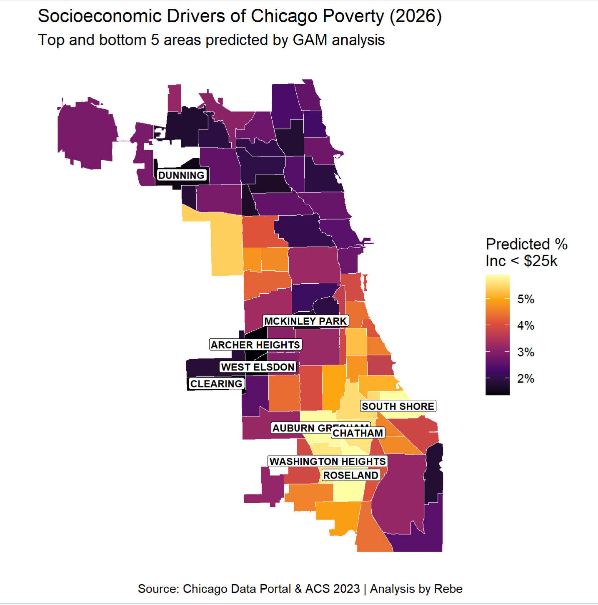

# Chicago-Poverty-Analysis-2026
Chicago Socioeconomic Analysis: Predicting Poverty Intensity (2026)
Executive Summary

This project evaluates the socioeconomic drivers of poverty across Chicago’s 77 community areas. While traditional linear models often fail to capture the complex, non-linear shifts in urban demographics, this analysis utilizes Generalized Additive Models (GAMs) to identify threshold effects where demographic concentrations significantly impact poverty rates (measured as households earning <$25,000).
The Framework: From Data to Diagnostics

Influenced by the Consortium framework and Theory of Change, this analysis treats data as a diagnostic tool rather than just a descriptive one. By identifying neighborhoods where poverty is "over-performing" or "under-performing" relative to demographic trends, we can better target social service interventions.
Key Technical Features:

    Statistical Pivot: Moved from OLS (Multiple Linear Regression) to GAMs after diagnostic plots revealed violations of linearity and homoscedasticity.

    Performance Boost: The GAM improved the explained deviance to ~37%, providing a more accurate fit for Chicago's diverse neighborhood profiles.

    Geospatial Visualization: Integrated sf and ggplot2 to create high-resolution maps identifying the Top 5 and Bottom 5 neighborhoods based on model predictions.

 
 
How to Reproduce

This project is designed for full reproducibility:

    Clone the Repository: Download the project folder.

    Initialize Project: Open Chicago_Poverty_Analysis.Rproj in RStudio. This ensures all file paths work automatically.

    Run the Script: Open Chicago_Poverty_Analysis_2026.R. The pacman library will automatically detect and install any missing packages (tidyverse, mgcv, sf, janitor, etc.).

Data Sources

    ACS 5-Year Estimates (2026): Socioeconomic and demographic indicators by Community Area.

    Chicago Data Portal: Community Area boundaries (chi_map).
